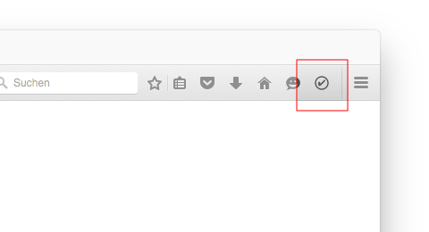
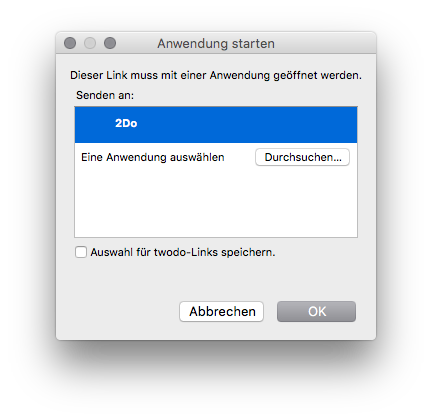

# 2Do-WebExtension

A [WebExtension](https://developer.mozilla.org/en-US/Add-ons/WebExtensions) to send the current tab to your 2Do inbox. Works with Chrome and Firefox.

* [Add to 2Do for Chrome](https://chrome.google.com/webstore/detail/add-to-2do/pljlbbaldemchhegnjbdnnfepmfoeccc)
* [Add to 2Do for Firefox](https://addons.mozilla.org/de/firefox/addon/add-to-2do/)

## What it does

Clicking the icon will create a new Task in your 2Do inbox for the currently active tab. The title of the Tab will be used as the text of the task, the URL will be present in the note. So will any text you had selected on the current page.

## Troubleshooting

Make sure you allow your browser to open `twodo`-links with the 2Do app.

## References

* The icon is property of the [2DoApp](http://www.2doapp.com/). Thanks for letting this project use it.
